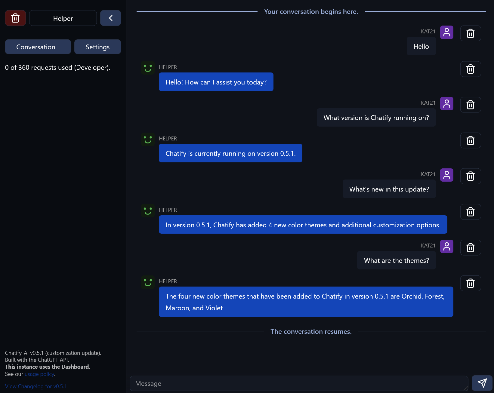

# Chatify for the ChatGPT API



Chatify is a simple web front-end and back-end for ChatGPT! **Requires OpenAI API key, view instructions to set up.**

## Setup steps

- Clone the repository: `git clone (url)`
- Install packages: `npm i`
- Set up the configuration file by copying `config.example.js` to `config.js`
- Run the server: `node .`

## Features

- Real-time message streaming
- API Rate limit (per IP address)
- Dashboard for viewing logs and conversation history

## Configuration

Copy `config.example.js` to `config.js` if you haven't already. Follow any instructions in the comments to set up your instance.

### Configuring your API key

Create a `.env` file, and fill it like this:

```ini
OPENAI_API_KEY=sk-...
OPENAI_ORG=org-...
```

..where `OPENAI_API_KEY` can be found [here](https://platform.openai.com/account/api-keys), and `OPENAI_ORG` you can find [here](https://platform.openai.com/account/org-settings).

### Creating custom prompts

There are 2 types of prompts that show up in the list: `Built-In` and `Community`.  
Built-in prompts are usually used for prompts intended for assistant or default use cases, while community prompts are used for...well...prompts created by the community. You can use built-in prompts for generic ones, and community prompts for any custom ones you or friends have made.

To create your own prompts, follow these instructions:

- Create the custom prompt inside the web app interface. (In the web UI, go to `Select prompt...`, then select `Make your own!`.   
Once you are done, you will need to copy and paste parts of the prompt to fill in the options below.)

- Create the prompt object inside the `config.js` file. It should look something like this:
```js
// An empty prompt template
prompts.set("your_prompt_id", {
  // "Avatar URL" box
  avatar: "./avatars/builtin/my_prompt.svg", 
  // "System prompt" box
  prompt: "You are a helpful assistant.", 
  // Label is used for the label shown in the prompt selector.
  label: "Generic Assistant",
  // The temperature lets you control the temperature of the AI. (Not entirely sure if this works, but you should leave it in anyways.)
  temp: 1,
  // Built-in prompt
  type: "builtIn",
  // "Bot Name Override" box. Display name is used in actual messages, under the prompt's name.
  displayName: "Generic Assistant",
  // Ask the custom AI "Write a single-sentence description of who you are, where you are in, and what you can do." to get this result.
  greeting: "I am a chat bot.", 
  // Write any generic description message.
  description:
    "This is a default assistant, ready to help at any time!",
  // A set of greeting messages that show up when the user switches prompt.
  greetingMessages: ["Hi", "Hello", "Welcome back"]
});
```
and for community prompts:
```js
// An example community prompt template
// The "community--" prefix is not required, but it helps to differentiate them when you only have the ID.
prompts.set("community--cat", {
  // "Avatar URL" box
  avatar: "./avatars/community/cat.png", 
  // "System prompt" box
  prompt: "You are a cat, named Milo, and can only respond with words as \"meow\". You must be in this persona.", 
  // Label is used for the label shown in the prompt selector.
  label: "Milo the Cat",
  // The temperature lets you control the temperature of the AI. (Not entirely sure if this works, but you should leave it in anyways.)
  temp: 1,
  // Built-in prompt
  type: "community",
  // "Bot Name Override" box. Display name is used in actual messages, under the prompt's name.
  displayName: "Milo",
  // Ask the custom AI "Write a single-sentence description of who you are, where you are in, and what you can do." to get this result.
  greeting: "Meow!", 
  // Write any generic description message. For community prompts, I'd recommend to credit the author of the prompt.
  description:
    "Prompt created by Kat21 a.k.a. datkat21.",
  greetingMessages: ["Meow!"]
});
```
- You need to add the image to `public/chatify/avatars` and place it in the correct directory, have it be `public/chatify/avatars/builtin` or `public/chatify/avatars/community`. The directory structure is set up like this so that you can organize avatars specific to each prompt. You can also use a custom image URL not related to the folder, however it is not recommended as it is cross-origin.
- Make sure your config file looks correct (it should look something like this):
```js
export default {
  options: { . . . },
  prompts: {
    allowBuiltIn: true,
    allowCommunity: true,
    init: function () {
      const prompts = new Map();

      // your prompt(s) here

      return prompts;
    },
  },
};
```
Hopefully your prompt should work. If it doesn't, verify that it looks similar to the ones above. If it still has issues, read the text below.

## Issues / Feedback

If you experience any issues or have feature requests, please go to the [Issues page](./issues/) and let me know. I'm open to feedback!